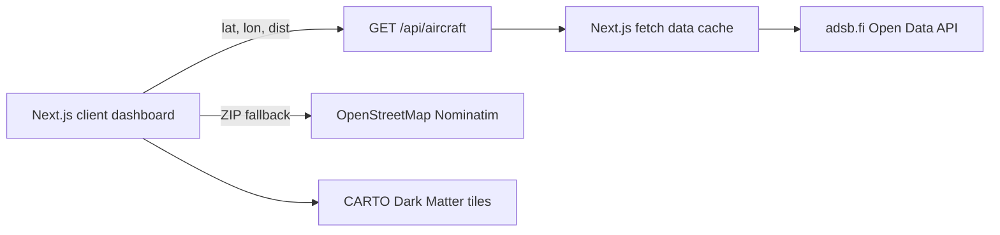

# Maximum Overhead

Maximum Overhead is a real-time ADS-B dashboard for exploring aircraft near a user-selected location. It combines a dark, aviation-inspired map with a sortable aircraft table, altitude-based visual encoding, aircraft-class filters, and session flight tracks.

The application is intended for personal, non-commercial use and is designed to run locally or on Vercel.

## Summary

- Resolves the viewer's location through browser geolocation, with a US ZIP-code fallback.
- Polls live aircraft data through a server-side API proxy rather than exposing the upstream service directly to the browser.
- Displays aircraft on a Leaflet map and in a sortable data table.
- Supports selectable search radii of 5, 10, 50, 100, 150, and 250 nautical miles; the default is 50 NM.
- Filters Commercial, General Aviation, and Military aircraft across both the table and map.
- Colors aircraft and selected flight tracks by 5,000-foot altitude bands.
- Shows aircraft details on map hover and full aircraft type descriptions from the feed in table tooltips.
- Retains up to approximately one hour of observed track history during the current browser session.

## Local Development

### Requirements

- Node.js 18.17 or newer
- npm
- A browser with geolocation support, or a valid five-digit US ZIP code

### Setup

```bash
npm install
cp .env.local.example .env.local
npm run dev
```

Open [http://localhost:3000](http://localhost:3000).

Available commands:

```bash
npm run dev    # Start the development server
npm run build  # Create a production build
npm run start  # Run the production build
npm run lint   # Run Next.js linting
npx tsc --noEmit  # Run TypeScript validation
```

### Configuration

| Variable | Default | Purpose |
|---|---:|---|
| `RADIUS_NM` | `50` | Server fallback radius when an API request omits `dist` |
| `POLL_INTERVAL_SEC` | `10` | Upstream cache revalidation interval; minimum 5 seconds |

The active radius is selected in the dashboard. No API key is required for the configured aircraft, map tile, or ZIP geocoding services.

## Architectural Overview



### Client

The App Router page renders a client-side dashboard built with React and Material UI. `LocationGate` owns location, polling, radius, filtering, selection, and session track state. `AircraftMap` renders Leaflet map layers and markers, while `AircraftTable` provides filters, metrics, sorting, and aircraft details.

The aircraft-class filters produce one shared visible-aircraft collection, ensuring the map and table remain synchronized. Track history remains in browser memory and is cleared when the location changes or an aircraft leaves the active feed.

### API Proxy and Cache

`GET /api/aircraft?lat={latitude}&lon={longitude}&dist={radius}` validates the request and proxies it to adsb.fi. Coordinates are rounded to two decimal places before constructing the upstream URL, improving cache reuse for nearby users. Next.js `fetch` revalidation provides the cache layer and limits unnecessary upstream requests.

The route normalizes the upstream response into a stable JSON envelope and reports unavailable or rate-limited feed states to the client. No aircraft data is stored in a database.

### Map and Location Services

Leaflet and React Leaflet render the map, search-radius ring, aircraft markers, and selected tracks. CARTO Dark Matter supplies raster map tiles. Browser geolocation is preferred; when unavailable or denied, the application resolves a US ZIP code through OpenStreetMap Nominatim.

## Support

Before reporting a problem:

1. Confirm the project is running on a supported Node.js version.
2. Run `npm install` and `npx tsc --noEmit`.
3. Check that `.env.local` contains valid numeric configuration values.
4. Confirm browser location permission is enabled, or use the ZIP-code fallback.
5. Check the status bar for feed-offline or rate-limit states.

For defects or enhancement requests, provide the browser and Node.js versions, steps to reproduce, the selected radius and filters, and relevant terminal or browser-console output. Do not include precise home coordinates or other sensitive location information in a public report.

## Data Attributions

- Aircraft position and metadata: [adsb.fi Open Data](https://opendata.adsb.fi/), subject to the provider's terms and personal, non-commercial use requirements.
- Map tiles: [CARTO Dark Matter](https://carto.com/basemaps/).
- Base map data: [OpenStreetMap contributors](https://www.openstreetmap.org/copyright).
- US ZIP-code geocoding: [OpenStreetMap Nominatim](https://nominatim.openstreetmap.org/).

Aircraft positions are community-sourced and may be delayed, incomplete, inaccurate, or unavailable. This dashboard is informational only and must not be used for navigation, flight operations, safety-critical decisions, surveillance, or emergency response.
